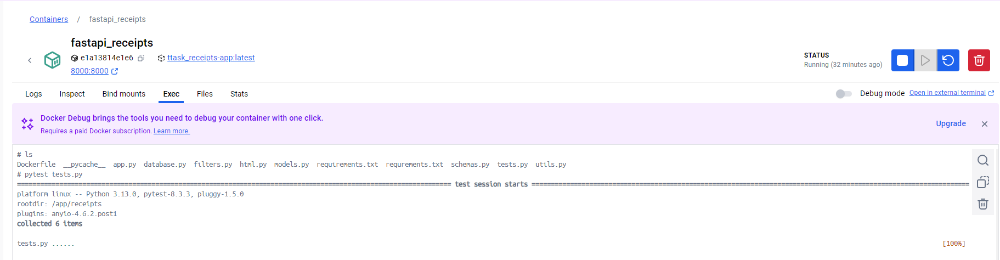
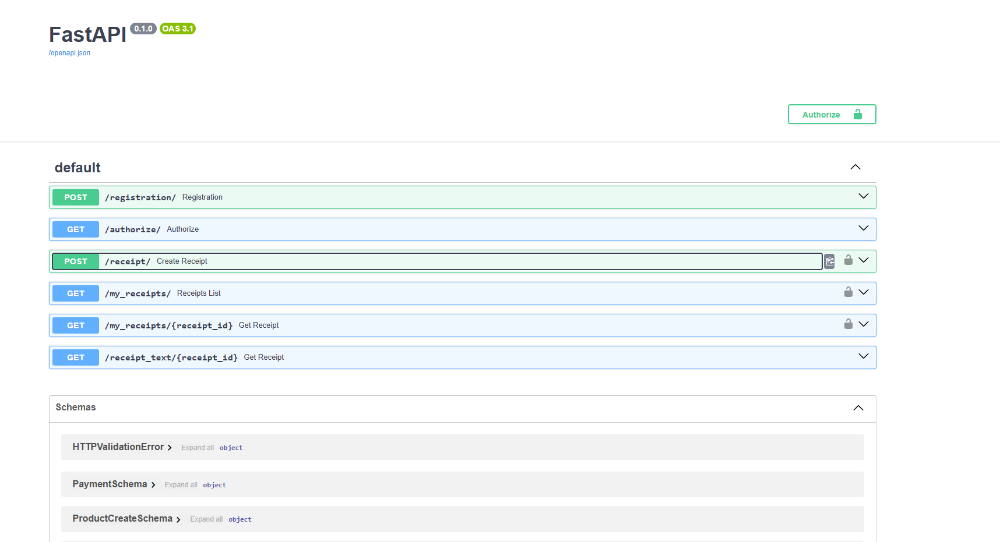
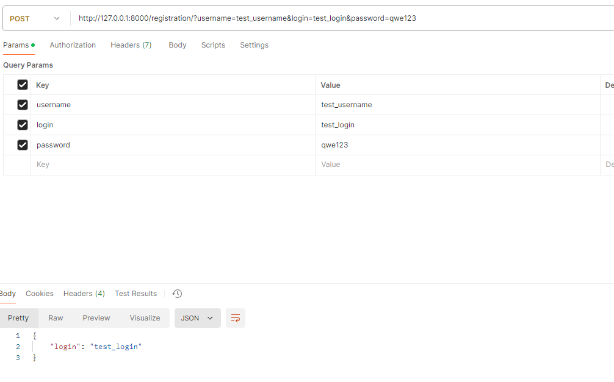
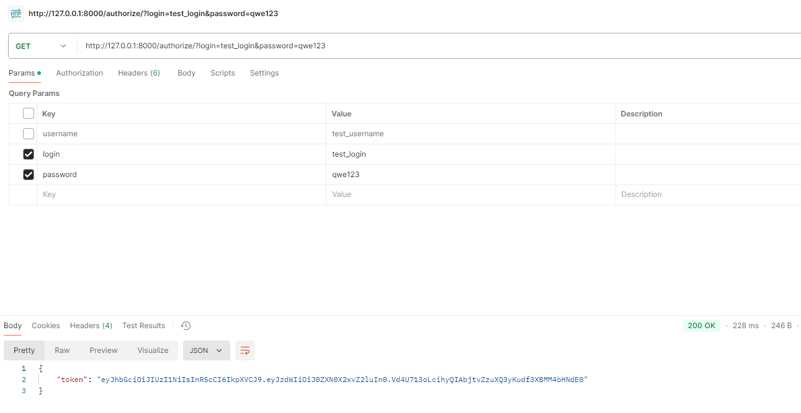
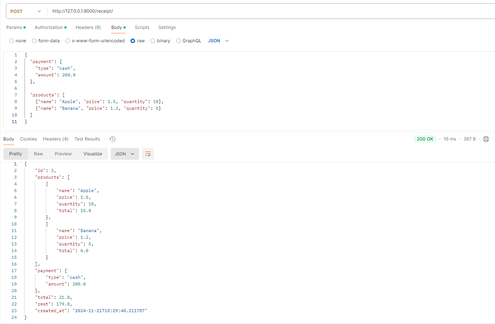
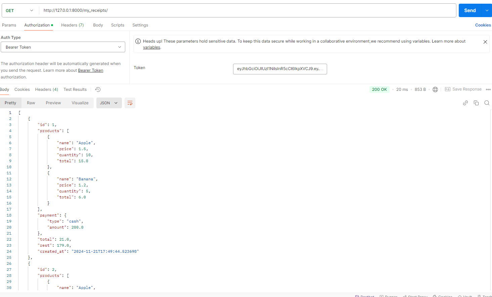
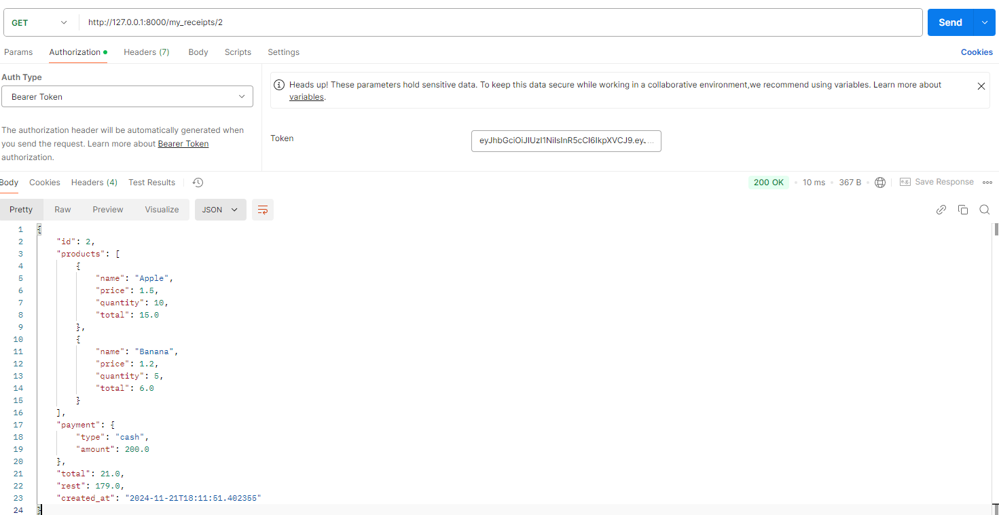
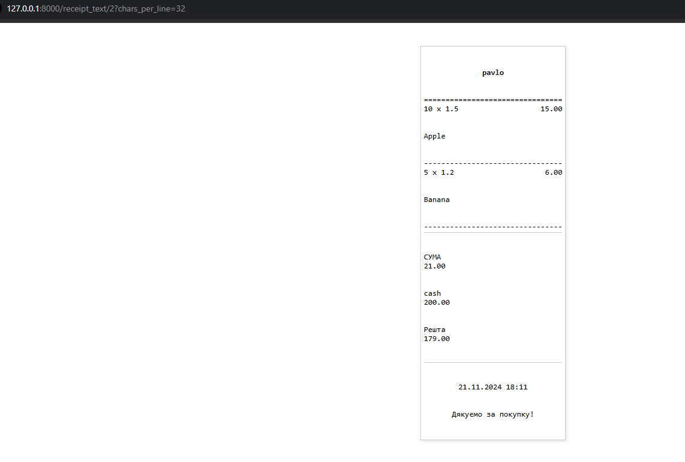

# Receipts

## Launching
To launch this project you need to install docker desctop on your PC

### Steps:

####1. Clone github repository on your local machine:  
`git clone https://github.com/pshkravets/ttask_receipts.git` 
   
####2. Come to root directory of this project and run container:  
`docker-compose up`

Now your application is launched and ready to use:) 
Also you can run tests in docker container:

## Endpoints 

### Enpoints list:
You can come from your browser and see what endpoints are avaliable: http://127.0.0.1:8000/docs

### /registration/
#### Method: POST  
#### Params: 
- login: uique value, required 
- usernamae: user's username, required
- password: user's password, required 

####Description:
Endpoint so that creates user's account

### /authorize/
#### Method: GET
#### Params: 
- login: required
- password: required

####Description:
Endpoint so user could authorizate and get his JWT

### /receipt/
#### Method: POST
#### Params: 
- Authorization Bearer Toke: requires authorize with JWT
- payment: includes type of payment(cash/cashless) and amount 
- product: list of products where each contains it's name, price and quantity

####Description:
Creates new Receipt

### /my_receipts/
#### Method: GET
#### Params: 
- Authorization Bearer Toke: requires authorize with JWT   

param filters:
- total__gt: return all receipts which total cost is greater then total__gt, not required
- total__lt: return all receipts which total cost is less then total__lt, not required
- type: returns specified type of payment (cash, cashless), not required
- created_at__gt: returns all receipts which were created after created_at__gt, not required
- created_at__lt: returns all receipts which were created before created_at__lt, not required
- param limit: set's pagination for receipts, not required
- param offset: set's offset, not required

####Description:
Return's filtered list of user's receipts

### /my_receipts/{receipt_id}/ 
#### Method: GET
#### Params: 
- receipt id, required

####Description:
Returns specific receipt by it's id

### /receipt_text/{receipt_id} 
#### Method: GET
#### Params: 
- receipt id, required
- chars_per_line, optional 

####Description:
Returns check in text(HTML) format

